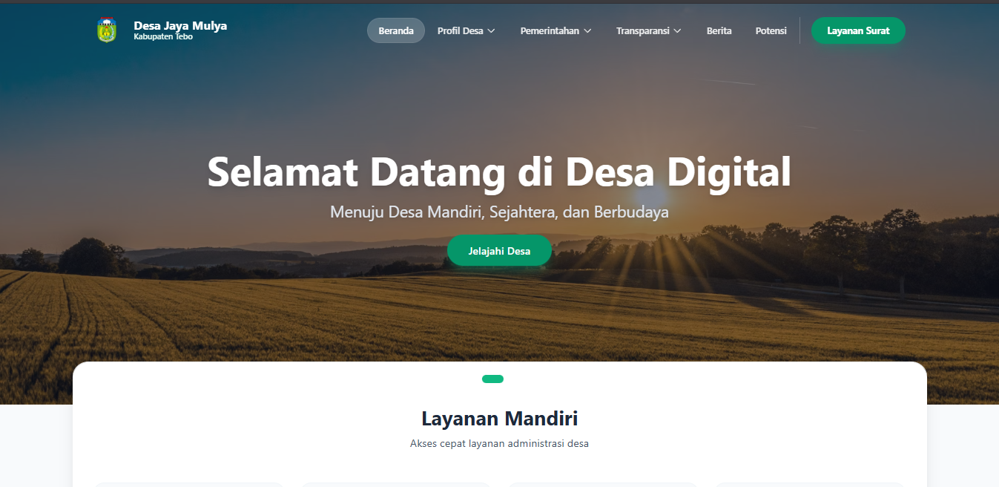
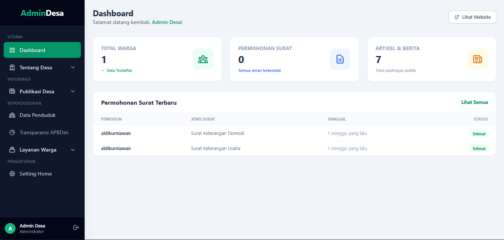
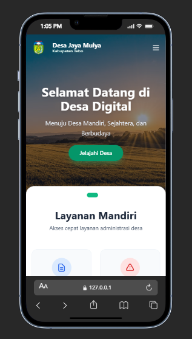

# SID - Sistem Informasi Desa Digital


**Sistem Informasi Desa (SID)** adalah platform digital terpadu yang dirancang untuk memodernisasi pelayanan administrasi desa, meningkatkan transparansi anggaran (APBDes), serta mempromosikan potensi desa secara luas. Aplikasi ini menghubungkan pemerintah desa dengan warga melalui layanan surat menyurat online dan portal informasi publik.

## 🌟 Fitur Utama

### 1. Halaman Publik (Warga)

- **Beranda Dinamis:** Slider informasi & sambutan yang dapat diubah oleh admin.
- **Layanan Mandiri:** Pengajuan surat keterangan (KTP, Domisili, dll) secara online.
- **Transparansi APBDes:** Infografis Realisasi Anggaran & Laporan Keuangan yang update.
- **Profil & Potensi:** Informasi sejarah, visi misi, dan potensi wisata/UMKM desa.
- **Responsive Mobile Menu:** Navigasi ramah seluler dengan model _accordion/dropdown_.

### 2. Panel Admin (Perangkat Desa)

- **CMS Pengaturan Website:**
    - Ubah Identitas Desa (Nama, Slogan, Logo).
    - Manajemen Slider Halaman Depan (Upload/Hapus Banner).
- **Manajemen Layanan:** Verifikasi dan cetak permohonan surat dari warga.
- **Manajemen Transparansi:** Input data Pagu Anggaran vs Realisasi (Penyerapan).
- **Manajemen Konten:** Publikasi Berita, Artikel, dan Potensi Desa.
- **Data Master:** Pengelolaan data Perangkat Desa dan Penduduk.

### 3. Antarmuka Modern (UI/UX)

- **Tema Emerald:** Desain bersih dan profesional dengan warna identitas hijau emerald.
- **Interactive Elements:** Penggunaan Alpine.js untuk dropdown, modal, dan sidebar yang mulus.
- **Data Visualization:** Progress bar dinamis untuk realisasi anggaran.

---

## 🛠️ Teknologi yang Digunakan

- **Backend:** Laravel 12 (PHP Framework)
- **Frontend:** Blade Templates
- **Styling:** Tailwind CSS
- **Interactivity:** Alpine.js
- **Database:** MySQL
- **Asset Bundling:** Vite

---

## 📸 Tangkapan Layar (Screenshots)

_(Simpan screenshot aplikasi Anda di folder `public/screenshots` lalu link di sini)_

|         Halaman Depan (Home)         |                Dashboard Admin                 |
| :----------------------------------: | :--------------------------------------------: |
|  |  |

|                    Transparansi APBDes                     |                       Mobile View                        |
| :--------------------------------------------------------: | :------------------------------------------------------: |
|  |  |

---

## 🚀 Cara Instalasi (Localhost)

Ikuti langkah-langkah berikut untuk menjalankan proyek ini di komputer lokal Anda:

### Prasyarat

- PHP >= 8.3
- Composer
- Node.js & NPM
- MySQL

### Langkah Instalasi

1.  **Clone Repositori**

    ```bash
    git clone [https://github.com/username-anda/desa-digital.git](https://github.com/username-anda/desa-digital.git)
    cd desa-digital
    ```

2.  **Install Dependencies**

    ```bash
    composer install
    npm install
    ```

3.  **Setup Environment**
    Salin file `.env.example` menjadi `.env`:

    ```bash
    cp .env.example .env
    ```

    Sesuaikan konfigurasi database di file `.env`:

    ```env
    DB_DATABASE=db_desa_digital
    DB_USERNAME=root
    DB_PASSWORD=
    ```

4.  **Generate App Key**

    ```bash
    php artisan key:generate
    ```

5.  **Migrasi & Seeding Database**
    Membuat tabel dan akun admin default:

    ```bash
    php artisan migrate --seed
    ```

6.  **Link Storage (PENTING)**
    Agar gambar logo dan slider yang diupload bisa muncul:

    ```bash
    php artisan storage:link
    ```

7.  **Jalankan Aplikasi**
    Buka 2 terminal berbeda:

    _Terminal 1 (Vite):_

    ```bash
    npm run dev
    ```

    _Terminal 2 (Laravel):_

    ```bash
    php artisan serve
    ```

    Akses aplikasi di: `http://localhost:8000`

---

## 🔐 Akun Default

Gunakan akun ini untuk masuk ke Panel Admin:

- **Email:** `admin@desa.id`
- **Password:** `password` (atau sesuai seeder Anda)

---

## 📂 Struktur Menu Admin

- **Dashboard**
- **Tentang Desa**
    - Profil Desa
    - Perangkat Desa
- **Layanan Warga**
    - Permohonan Surat
    - Aspirasi & Pengaduan
- **Publikasi Desa**
    - Berita & Artikel
    - Potensi (UMKM/Wisata)
- **Data & Transparansi**
    - Data Penduduk
    - Transparansi APBDes
- **Pengaturan**
    - Setting Home (Identitas & Slider)

---

## 🤝 Kontribusi

Kontribusi selalu diterima!

1.  Fork Project ini
2.  Buat Feature Branch (`git checkout -b fitur-baru`)
3.  Commit perubahan (`git commit -m 'Menambah fitur X'`)
4.  Push ke Branch (`git push origin fitur-baru`)
5.  Open Pull Request

---

## 📝 Lisensi

Proyek ini bersifat _Open Source_ dan dilisensikan di bawah [MIT License](LICENSE).
Hak Cipta © 2026 [Aldi Kurniawan](https://github.com/Aldikurniawan19).
